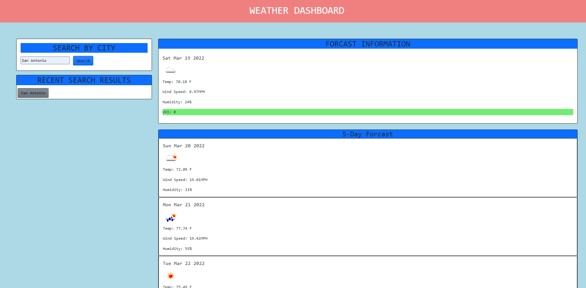

# Challenge-06
## Weather Application

for the sixth challenge of my bootcamp, I am tasked with creating a website that utilizes server end API's to retrieve weather for whichever city the user desires. I am going to be using bootstrap and jquery to the best of my ability.
 
 

## Criteria to be considered complete (Mar. 2022)

> WHEN I search for a city
- THEN I am presented with current and future conditions for that city and that city is added to the search history
> WHEN I view current weather conditions for that city
- THEN I am presented with the city name, the date, an icon representation of weather conditions, the temperature, the humidity, the wind speed, and the UV index
> WHEN I view the UV index
- THEN I am presented with a color that indicates whether the conditions are favorable, moderate, or severe
> WHEN I view future weather conditions for that city
- THEN I am presented with a 5-day forecast that displays the date, an icon representation of weather conditions, the temperature, the wind speed, and the humidity
> WHEN I click on a city in the search history
- THEN I am again presented with current and future conditions for that city
 
 

link to deployed website: *placeholdertext*

I tend to say this a lot in my post README wrap ups, but this week was incredibly difficult. I'm noticing my grasp of bootstrap and css in general is slowly improving, but I am still lacking in many areas. The hardest portion of this challenge was adding functionality to the history buttons. I learned that the buttons are unable to pass value if I don't assign it before hand AND add the eventListener during creation. I could be wrong, but elements that soley exist on the DOM need further care when using them during queries and the such, as opposed to raw coded html elements. I am also currently juggling this assignment AND a group project so this is defintitely a test of endurance. All in all, the module accompanying this challenge really helped with my understanding of server side API's and how to parse the JSON information for everything I needed. Maybe one day my CSS will look more professional but for now, functionality over bells and whistles. Here's to another arduous but fulfilling week.

-J

